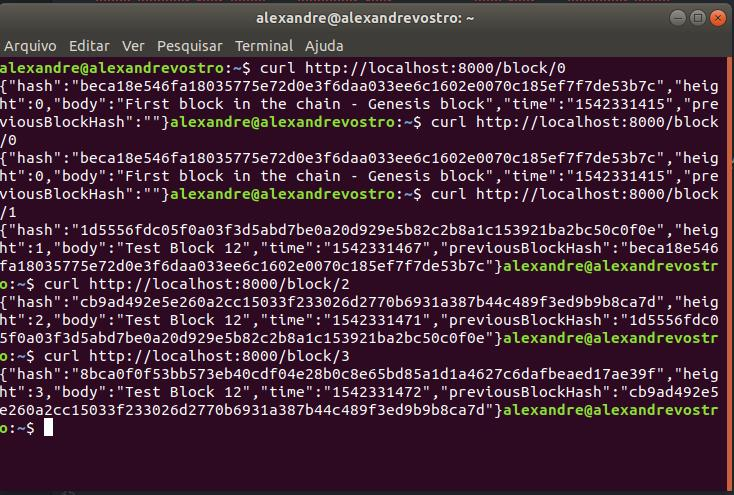

# Project 3 - Blockchain Udacity Course

This project is the third in Udacity Blockchai course. The challenge is to build a RESTful web API using a Node.js framwork that will interface with our private BlockChain.

## Getting Started

These instructions will get you a copy of the project up and running on your local machine for development and testing purposes. See deployment for notes on how to deploy the project on a live system.

### Prerequisites

What things you need to install the software and how to install them

```
npm install
```

### Installing

A step by step series of examples that tell you how to get a development env running

Just run the app on the comand line like this

```
nodejs index.js

```

And will show this

```
Listening on port8000
```

## Endpoints

For better test, I recomend use Postman to test this RESTful app, but you can use curl too.

###GET Block Endpoint

GET Block Endpoint
Configure a GET request using URL path with a block height parameter. The response for the endpoint should provide block object is JSON format.

URL
http://localhost:8000/block/[blockheight]

Example URL path:
http://localhost:8000/block/0, where '0' is the block height.



Response
The response for the endpoint should provide block object is JSON format.

Example GET Response
For URL, http://localhost:8000/block/0

```HTTP/1.1 200 OK
content-type: application/json; charset=utf-8
cache-control: no-cache
content-length: 179
accept-ranges: bytes
Connection: close          
{"hash":"49cce61ec3e6ae664514d5fa5722d86069cf981318fc303750ce66032d0acff3","height":0,"body":"First block in the chain - Genesis block","time":"1530311457","previousBlockHash":""}
```
###POST Block Endpoint

Post a new block with data payload option to add data to the block body. The block body should support a string of text. The response for the endpoint should provide block object in JSON format.

Response
The response for the endpoint should provide block object in JSON format.

Example POST response
For URL: http://localhost:8000/block

```HTTP/1.1 200 OK
content-type: application/json; charset=utf-8
cache-control: no-cache
content-length: 238
Connection: close
{"hash":"ffaffeb2330a12397acc069791323783ef1a1c8aab17ccf2d6788cdab0360b90","height":1,"body":"Testing block with test string data","time":"1531764891","previousBlockHash":"49cce61ec3e6ae664514d5fa5722d86069cf981318fc303750ce66032d0acff3"}
```

## Built With - Sources I research for this project:

* [javascript](https://developer.mozilla.org/en-US/docs/Web/JavaScript/Reference/Operators/await) - Await
* [Javascript](https://www.promisejs.org/) - Promises
* [Javascript](http://eloquentjavascript.net/) - Javascript
* [BlockChain](https://github.com/nimish-jose/blockchainnd/blob/master/Project_2/simpleChain.js) - used to see how a full blockchain_project working
diference between var and let
* [javascript](https://codeburst.io/asynchronous-code-inside-an-array-loop-c5d704006c99) - var and let
* [javascript](https://medium.com/javascript-scene/javascript-es6-var-let-or-const-ba58b8dcde75) - var and let
