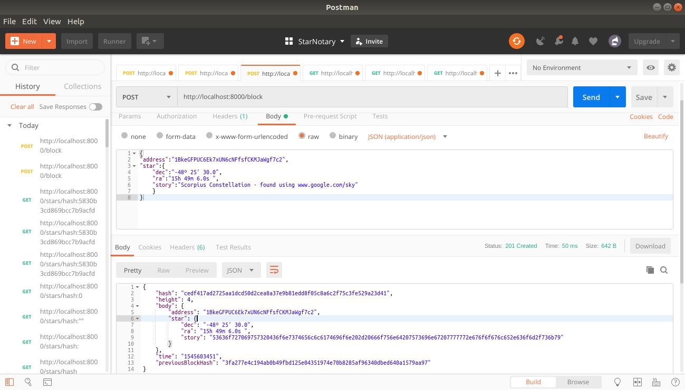

# Project 4 - Blockchain Udacity Course

In this project, you will build a Star Registry Service that allows users to claim ownership of their favorite star in the night sky.

## Getting Started

These instructions will get you a copy of the project up and running on your local machine for development and testing purposes. See deployment for notes on how to deploy the project on a live system.

### Prerequisites

What things you need to install the software and how to install them

```
npm install
```

### Installing

A step by step series of examples that tell you how to get a developmentenv running

Just run the app on the comand line like this

```
nodejs index.js

```

And will show this

```
Listening on port8000
```

## Endpoints

For better test, I recomend use Postman to test this RESTful app, but you can use curl too.

```
GET /blocks
    Returns a JSON array of all blocks in the chain

GET /blocks/:BLOCK_HEIGHT
    Returns a block at a specific height

POST /block
    Adds a new block to the chain

POST /requestValidation
    This signature proves the users blockchain identity. Upon validation of this identity, the user should be granted access to register a single star.

POST /message-signature/validate
    After receiving the response, users will prove their blockchain identity by signing a message with their wallet. Once they sign this message, the application will validate their request and grant access to register a star.

GET /stars/address:[ADDRESS]
    Get star block(s) by wallet address

GET /stars/hash:[HASH]
    Get star block by hash
```    


### POST Block Endpoint

# 1.Validate Request and signature message

Using post method send your wallet Address
```
http://localhost:8000/requestValidation

```
Signature your message in your wallet, then use this to validate it.

```
http://localhost:8000/message-signature/validate

```

# 2 Post a new Star
Post a new block with data payload option to add data to the block body. The block body should support a string of text. The response for the endpoint should provide block object in JSON format.


Example POST response
For URL: http://localhost:8000/block

```
{
"address":"1BkeGFPUC6Ek7xUN6cNFfsfCKMJaWgf7c2",
"star":{
	"dec":"-48º 25' 30.0",
	"ra":"15h 49m 6.0s ",
	"story":"Scorpius Constellation - found using www.google.com/sky"
	}
}
```




### GET Block Endpoint - Getting the blocks by height, hash or address

Configure a GET request using URL path with a block height parameter. The response for the endpoint should provide block object is JSON format.


# 1 Get Block by Height
URL
http://localhost:8000/block/[blockheight]

Example URL path:
http://localhost:8000/block/0, where '0' is the block height.

Response
The response for the endpoint should provide block object is JSON format.

Example GET Response
For URL, http://localhost:8000/block/4

```
{
    "hash": "cedf417ad2725aa1dcd50d2cea8a37e9b81edd8f05c8a6c2f75c3fe529a23d41",
    "height": 4,
    "body": {
        "address": "1BkeGFPUC6Ek7xUN6cNFfsfCKMJaWgf7c2",
        "star": {
            "dec": "-48º 25' 30.0",
            "ra": "15h 49m 6.0s ",
            "story": "53636f727069757320436f6e7374656c6c6174696f6e202d20666f756e64207573696e67207777772e676f6f676c652e636f6d2f736b79"
        }
    },
    "time": "1545603451",
    "previousBlockHash": "3fa277e4c194ab0b49fbd125e04351974e70b8285af96340dbed640a1579aa97"
}

```

# 2 Get block by Address

```
http://localhost:8000/stars/address:1BkeGFPUC6Ek7xUN6cNFfsfCKMJaWgf7c2
```
Resṕonse - all the blocks for that Address
```
{
        "hash": "cedf417ad2725aa1dcd50d2cea8a37e9b81edd8f05c8a6c2f75c3fe529a23d41",
        "height": 4,
        "body": {
            "address": "1BkeGFPUC6Ek7xUN6cNFfsfCKMJaWgf7c2",
            "star": {
                "dec": "-48º 25' 30.0",
                "ra": "15h 49m 6.0s ",
                "story": "53636f727069757320436f6e7374656c6c6174696f6e202d20666f756e64207573696e67207777772e676f6f676c652e636f6d2f736b79",
                "storyDecoded": "Scorpius Constellation - found using www.google.com/sky"
            }
        },
        "time": "1545603451",
        "previousBlockHash": "3fa277e4c194ab0b49fbd125e04351974e70b8285af96340dbed640a1579aa97"
    }
```

# 3 Get block by Hash
```
http://localhost:8000/stars/hash:cedf417ad2725aa1dcd50d2cea8a37e9b81edd8f05c8a6c2f75c3fe529a23d41
```

Will return the block who contains that hash

```
{
    "hash": "cedf417ad2725aa1dcd50d2cea8a37e9b81edd8f05c8a6c2f75c3fe529a23d41",
    "height": 4,
    "body": {
        "address": "1BkeGFPUC6Ek7xUN6cNFfsfCKMJaWgf7c2",
        "star": {
            "dec": "-48º 25' 30.0",
            "ra": "15h 49m 6.0s ",
            "story": "53636f727069757320436f6e7374656c6c6174696f6e202d20666f756e64207573696e67207777772e676f6f676c652e636f6d2f736b79",
            "storyDecoded": "Scorpius Constellation - found using www.google.com/sky"
        }
    },
    "time": "1545603451",
    "previousBlockHash": "3fa277e4c194ab0b49fbd125e04351974e70b8285af96340dbed640a1579aa97"
}
```


## Built With - Sources I research for this project:

* [javascript](https://developer.mozilla.org/en-US/docs/Web/JavaScript/Reference/Operators/await) - Await
* [Javascript](https://www.promisejs.org/) - Promises
* [Javascript](http://eloquentjavascript.net/) - Javascript
* [BlockChain](https://github.com/nimish-jose/blockchainnd/blob/master/Project_2/simpleChain.js) - used to see how a full blockchain_project working
diference between var and let
* [javascript](https://codeburst.io/asynchronous-code-inside-an-array-loop-c5d704006c99) - var and let
* [javascript](https://medium.com/javascript-scene/javascript-es6-var-let-or-const-ba58b8dcde75) - var and let
